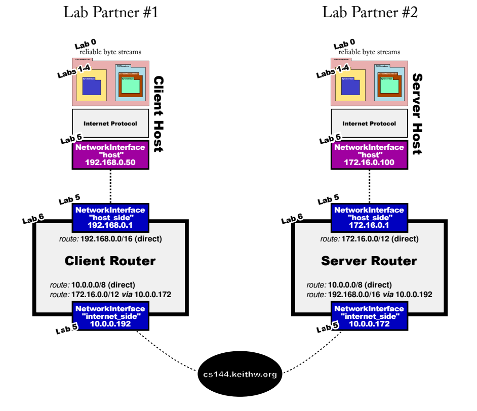

## Introduction

CS144 is an introductory course about computer networks. You will learn about the basic principles of computer
networks, for example packet switching, layering, encapsulation and protocols; and you will learn how applications
such as the world-wide-web, video streaming (e.g. Netflix and Hulu), video conferencing (e.g. Zoom and Skype) and
BitTorrent use the network to communicate. You will spend quite a lot of time learning about the specifics of how the
Internet works – which is of course by far the biggest computer network ever built. You will learn how applications
communicate reliably over an unreliable Internet. And you will build portions of the Internet yourself! In fact, we
believe that in CS144 you build more parts of the Internet infrastructure than in any other undergraduate networking
class anywhere. It’s really fun to see how the individual pieces work: You build an Internet router, and a reliable data
delivery service, and then you use it to communicate with remote servers.

In addition to lectures, we will also have a few in-class guest lectures by outside speakers. All the guest lecturers are
excellent speakers with many years of experience making networks work at huge scale. We will also have one or more
in-class exercises, which you will complete during the regular lecture time. These are designed to give you hands-on
experience with tools that are useful for your labs.

[logistics](https://cs144.github.io/logistics.pdf)

## Lab Overview

| Lab | My Progress | 
|:---:|:---: | 
| Lab 0 : networking warmup| [Notes](../STANFORD-CS144/lab0) | 
| Lab 1 : stitching substrings into a byte stream| | 
| Lab 2 : the TCP receiver| | 
| Lab 3 : the TCP sender| | 
| Lab 4 : the TCP connection| | 
| Lab 5 : the network interface| | 
| Lab 6 : the IP router| | 
| Lab 7 : putting it all together| | 