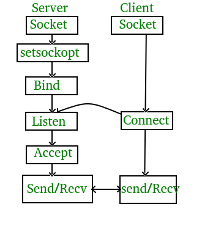

### Course Material:
[Course Website](https://cs144.github.io/)  
[Hangout](https://cs144.github.io/assignments/lab0.pdf)

### Webget:

From [TCPsocket documentation](https://cs144.github.io/doc/lab0/class_t_c_p_socket.html), the example code looks like bellow, But please aware that there is not any **HTTP request** here, the address is a **local address**, and the example code consisted of both **server** and **client** .  

Example code from [TCPsocket documentation](https://cs144.github.io/doc/lab0/class_t_c_p_socket.html)
```c++
const uint16_t portnum = ((std::random_device()()) % 50000) + 1025;
 
// create a TCP socket, bind it to a local address, and listen
TCPSocket sock1;
sock1.bind(Address("127.0.0.1", portnum));
sock1.listen(1);
 
// create another socket and connect to the first one
TCPSocket sock2;
sock2.connect(Address("127.0.0.1", portnum));
 
// accept the connection
auto sock3 = sock1.accept();
sock3.write("hi there");
 
auto recvd = sock2.read();
sock2.write("hi yourself");
 
auto recvd2 = sock3.read();
 
sock1.close();              // don't need to accept any more connections
sock2.close();              // you can call close(2) on a socket
sock3.shutdown(SHUT_RDWR);  // you can also shutdown(2) a socket
if (recvd != "hi there" || recvd2 != "hi yourself") {
    throw std::runtime_error("wrong data received");
}
```

**C/C++ socket**



From the image above, we can understand we just need 1 socket to  
1. connect to the server
2. send a request
3. read the response.


#### Notes:

- Following section 2.1 should give you enough information to what you need to do actually
- Figure out how a HTTP request is form might be useful


### Byte Stream:

The tricky part (if have) is choosing the correct data structure for the storage of Byte Stream, We could know the datastructure should support `push_back()` and `pop_front()` for `write()` and `read()` functions. Therefore I choose to use `deque<char>` for storage, `vector<char>` will work too but definitely not as efficient as deque does as pop_front() in vector require O(N) time complexity while pop_front() in deque require O(1) time complexity
